# Proyecto PostgreSQL Avanzado

**Autor:** Julio David Flores Conde

## NOMBRE DEL PROYECTO: BASE DE DATOS DE ALERTAMIENTOS AÉREOS


### Descripción de la Base de Datos

Esta base de datos está diseñada para registrar y gestionar todos los alertamientos detectados por el sistema de radares de la República Mexicana. Facilita el seguimiento y apoyo en la intercepción de tráficos aéreos ilegales mediante un sistema organizado de tablas y relaciones. A continuación, se describen las principales tablas y sus propósitos:

1. **Tabla `bitacora`**: Registra los detalles de cada alertamiento, incluyendo fecha y hora de detección, tipo de tráfico, estado, rumbo, coordenadas y observaciones. Se relaciona con otras tablas para obtener información adicional sobre el país de detección, resultado, responsable del turno y más.
2. **Tabla `cat_grados`**: Almacena los diferentes grados de los elementos responsables.
3. **Tabla `cat_pais`**: Contiene los nombres de los países para referenciar el país de detección y PCR.
4. **Tabla `cat_resultado`**: Almacena los posibles resultados de las intercepciones.
5. **Tabla `cat_rumbo`**: Contiene los rumbos posibles de los tráficos detectados.
6. **Tabla `cat_tipo_trafico`**: Define los tipos de tráfico que pueden ser detectados.
7. **Tabla `cat_trafico_status`**: Almacena los estados posibles del tráfico detectado.
8. **Tabla `cat_turno`**: Contiene los diferentes turnos de los responsables del monitoreo.
9. **Tabla `tbl_elementos`**: Registra información sobre los elementos responsables de la detección y seguimiento, incluyendo nombres, apellidos, expediente, grado y estado.
10. **Tabla `tbl_status_responsable`**: Define los estados posibles de los responsables.
11. **Tabla `user_access`**: Administra los accesos de usuarios al sistema, almacenando nombres de usuario, contraseñas y correos electrónicos.

### Relaciones

Las tablas están interconectadas mediante claves foráneas para mantener la integridad de los datos y facilitar la referencia cruzada entre diferentes tipos de información. Por ejemplo:

- La tabla `bitacora` referencia a `tbl_elementos` para identificar al elemento que capturó el alertamiento.
- `bitacora` también referencia a `cat_pais` para obtener el país de detección y PCR.
- Otras relaciones similares se establecen para resultados, rumbos, tipos de tráfico, estados de tráfico y turnos.

### Mejoras en la Gestión de Datos

El uso de estas tablas y relaciones permite un manejo más eficiente y organizado de la información, facilitando el seguimiento y la toma de decisiones en la intercepción de tráficos aéreos ilegales.


### Diagrama Entidad-Relación

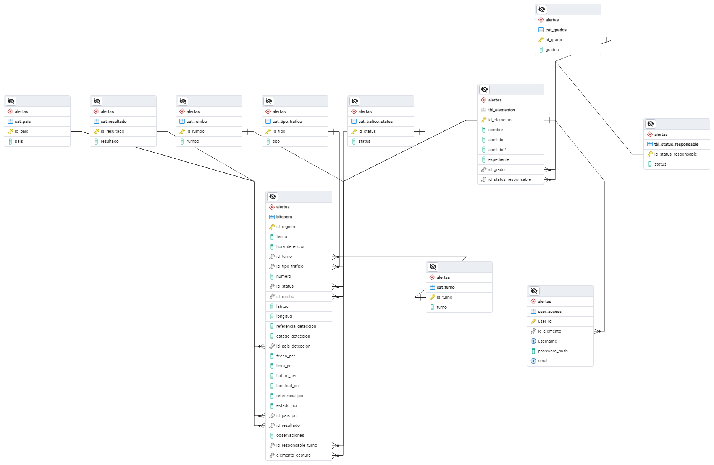

### Código SQL para Generar la Base de Datos

```sql
-- This script was generated by the ERD tool in pgAdmin 4.
-- Please log an issue at https://github.com/pgadmin-org/pgadmin4/issues/new/choose if you find any bugs, including reproduction steps.
BEGIN;

CREATE TABLE IF NOT EXISTS alertas.bitacora
(
    id_registro serial NOT NULL,
    fecha date NOT NULL,
    hora_deteccion time without time zone NOT NULL,
    id_turno integer,
    id_tipo_trafico integer,
    numero integer,
    id_status integer,
    id_rumbo integer,
    latitud numeric(9, 6),
    longitud numeric(9, 6),
    referencia_deteccion text COLLATE pg_catalog."default",
    estado_deteccion character varying(50) COLLATE pg_catalog."default",
    id_pais_deteccion integer,
    fecha_pcr date,
    hora_pcr time without time zone,
    latitud_pcr numeric(9, 6),
    longitud_pcr numeric(9, 6),
    referencia_pcr text COLLATE pg_catalog."default",
    estado_pcr character varying(50) COLLATE pg_catalog."default",
    id_pais_pcr integer,
    id_resultado integer,
    observaciones text COLLATE pg_catalog."default",
    id_responsable_turno integer,
    elemento_capturo integer,
    CONSTRAINT bitacora_pkey PRIMARY KEY (id_registro)
);

CREATE TABLE IF NOT EXISTS alertas.cat_grados
(
    id_grado serial NOT NULL,
    grados character varying(100) COLLATE pg_catalog."default" NOT NULL,
    CONSTRAINT cat_grados_pkey PRIMARY KEY (id_grado)
);

CREATE TABLE IF NOT EXISTS alertas.cat_pais
(
    id_pais serial NOT NULL,
    pais character varying(100) COLLATE pg_catalog."default" NOT NULL,
    CONSTRAINT cat_pais_pkey PRIMARY KEY (id_pais)
);

CREATE TABLE IF NOT EXISTS alertas.cat_resultado
(
    id_resultado serial NOT NULL,
    resultado character varying(100) COLLATE pg_catalog."default" NOT NULL,
    CONSTRAINT cat_resultado_pkey PRIMARY KEY (id_resultado)
);

CREATE TABLE IF NOT EXISTS alertas.cat_rumbo
(
    id_rumbo serial NOT NULL,
    rumbo character varying(100) COLLATE pg_catalog."default" NOT NULL,
    CONSTRAINT cat_rumbo_pkey PRIMARY KEY (id_rumbo)
);

CREATE TABLE IF NOT EXISTS alertas.cat_tipo_trafico
(
    id_tipo serial NOT NULL,
    tipo character varying(100) COLLATE pg_catalog."default" NOT NULL,
    CONSTRAINT cat_tipo_trafico_pkey PRIMARY KEY (id_tipo)
);

CREATE TABLE IF NOT EXISTS alertas.cat_trafico_status
(
    id_status serial NOT NULL,
    status character varying(100) COLLATE pg_catalog."default" NOT NULL,
    CONSTRAINT cat_trafico_status_pkey PRIMARY KEY (id_status)
);

CREATE TABLE IF NOT EXISTS alertas.cat_turno
(
    id_turno serial NOT NULL,
    turno character varying(100) COLLATE pg_catalog."default" NOT NULL,
    CONSTRAINT cat_turno_pkey PRIMARY KEY (id_turno)
);

CREATE TABLE IF NOT EXISTS alertas.tbl_elementos
(
    id_elemento serial NOT NULL,
    nombre character varying(100) COLLATE pg_catalog."default" NOT NULL,
    apellido character varying(100) COLLATE pg_catalog."default" NOT NULL,
    apellido2 character varying(100) COLLATE pg_catalog."default" NOT NULL,
    expediente character varying(100) COLLATE pg_catalog."default" NOT NULL,
    id_grado integer,
    id_status_responsable integer,
    CONSTRAINT tbl_elementos_pkey PRIMARY KEY (id_elemento)
);

CREATE TABLE IF NOT EXISTS alertas.tbl_status_responsable
(
    id_status_responsable serial NOT NULL,
    status character varying(100) COLLATE pg_catalog."default" NOT NULL,
    CONSTRAINT tbl_status_responsable_pkey PRIMARY KEY (id_status_responsable)
);

CREATE TABLE IF NOT EXISTS alertas.user_access
(
    user_id serial NOT NULL,
    id_elemento integer NOT NULL,
    username character varying(50) COLLATE pg_catalog."default" NOT NULL,
    password_hash character varying(255) COLLATE pg_catalog."default" NOT NULL,
    email character varying(100) COLLATE pg_catalog."default" NOT NULL,
    CONSTRAINT user_access_pkey PRIMARY KEY (user_id),
    CONSTRAINT user_access_email_key UNIQUE (email),
    CONSTRAINT user_access_username_key UNIQUE (username)
);

ALTER TABLE IF EXISTS alertas.bitacora
    ADD CONSTRAINT bitacora_elemento_capturo_fkey FOREIGN KEY (elemento_capturo)
    REFERENCES alertas.tbl_elementos (id_elemento) MATCH SIMPLE
    ON UPDATE NO ACTION
    ON DELETE NO ACTION;

ALTER TABLE IF EXISTS alertas.bitacora
    ADD CONSTRAINT bitacora_id_pais_deteccion_fkey FOREIGN KEY (id_pais_deteccion)
    REFERENCES alertas.cat_pais (id_pais) MATCH SIMPLE
    ON UPDATE NO ACTION
    ON DELETE NO ACTION;

ALTER TABLE IF EXISTS alertas.bitacora
    ADD CONSTRAINT bitacora_id_pais_pcr_fkey FOREIGN KEY (id_pais_pcr)
    REFERENCES alertas.cat_pais (id_pais) MATCH SIMPLE
    ON UPDATE NO ACTION
    ON DELETE NO ACTION;

ALTER TABLE IF EXISTS alertas.bitacora
    ADD CONSTRAINT bitacora_id_responsable_turno_fkey FOREIGN KEY (id_responsable_turno)
    REFERENCES alertas.tbl_elementos (id_elemento) MATCH SIMPLE
    ON UPDATE NO ACTION
    ON DELETE NO ACTION;

ALTER TABLE IF EXISTS alertas.bitacora
    ADD CONSTRAINT bitacora_id_resultado_fkey FOREIGN KEY (id_resultado)
    REFERENCES alertas.cat_resultado (id_resultado) MATCH SIMPLE
    ON UPDATE NO ACTION
    ON DELETE NO ACTION;

ALTER TABLE IF EXISTS alertas.bitacora
    ADD CONSTRAINT bitacora_id_rumbo_fkey FOREIGN KEY (id_rumbo)
    REFERENCES alertas.cat_rumbo (id_rumbo) MATCH SIMPLE
    ON UPDATE NO ACTION
    ON DELETE NO ACTION;

ALTER TABLE IF EXISTS alertas.bitacora
    ADD CONSTRAINT bitacora_id_status_fkey FOREIGN KEY (id_status)
    REFERENCES alertas.cat_trafico_status (id_status) MATCH SIMPLE
    ON UPDATE NO ACTION;

ALTER TABLE IF EXISTS alertas.bitacora
    ADD CONSTRAINT bitacora_id_tipo_trafico_fkey FOREIGN KEY (id_tipo_trafico)
    REFERENCES alertas.cat_tipo_trafico (id_tipo) MATCH SIMPLE
    ON UPDATE NO ACTION
    ON DELETE NO ACTION;

ALTER TABLE IF EXISTS alertas.bitacora
    ADD CONSTRAINT bitacora_id_turno_fkey FOREIGN KEY (id_turno)
    REFERENCES alertas.cat_turno (id_turno) MATCH SIMPLE
    ON UPDATE NO ACTION
    ON DELETE NO ACTION;

ALTER TABLE IF EXISTS alertas.tbl_elementos
    ADD CONSTRAINT tbl_elementos_id_grado_fkey FOREIGN KEY (id_grado)
    REFERENCES alertas.cat_grados (id_grado) MATCH SIMPLE
    ON UPDATE NO ACTION
    ON DELETE NO ACTION;

ALTER TABLE IF EXISTS alertas.tbl_elementos
    ADD CONSTRAINT tbl_elementos_id_status_responsable_fkey FOREIGN KEY (id_status_responsable)
    REFERENCES alertas.tbl_status_responsable (id_status_responsable) MATCH SIMPLE
    ON UPDATE NO ACTION
    ON DELETE NO ACTION;

ALTER TABLE IF EXISTS alertas.user_access
    ADD CONSTRAINT fk_elemento FOREIGN KEY (id_elemento)
    REFERENCES alertas.tbl_elementos (id_elemento) MATCH SIMPLE
    ON UPDATE NO ACTION
    ON DELETE NO ACTION;

END;

```
### Obtención de datos


Se realiza la carga de datos en la tabla bitacora, dando click derecho sobre la tabla y seleccionar importar datos, y se hace el procedimiento de las siguientes fotos.

**Paso 1**


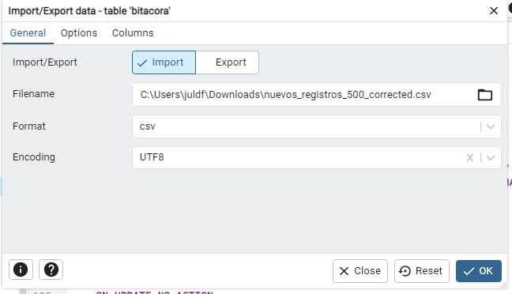


**Paso 2**


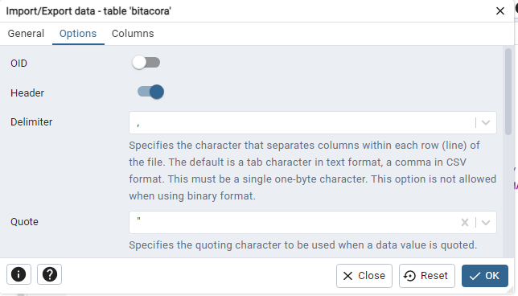


**Paso 3**


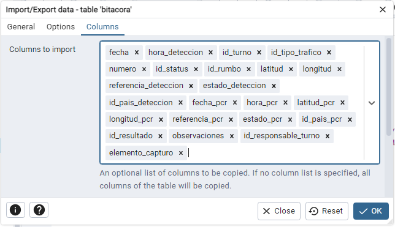


### Archivo de datos.

[Descargar archivo de datos](https://github.com/Juliodfconde/Curso_postgress/blob/main/nuevos_registros_500_corrected.csv)


### Optimizacion de consultas


Se crea un índice para los países y se realiza la misma consulta antes y después de la creación del índice para comparar la mejora en el tiempo de respuesta.

`creacion de indice`

```sql
CREATE INDEX idx_pais_deteccion ON alertas.bitacora(id_pais_deteccion);
```

`Consulta a sin indice y su resultado`


```sql
EXPLAIN ANALYZE SELECT * FROM alertas.bitacora WHERE id_pais_deteccion=1;
```

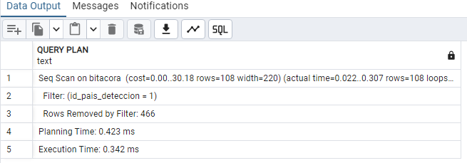

`Consulta a con indice y su resultado` 

```sql
EXPLAIN ANALYZE SELECT * FROM alertas.bitacora WHERE id_pais_deteccion=1;
```

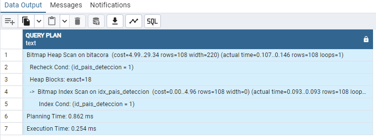


### Creacion de un rol de solo lectura

#### Pasos para Crear el Rol de Solo Lectura

#### 1. Abrir pgAdmin y Conectarse al Servidor:
- Abre pgAdmin y conéctate a tu servidor PostgreSQL.

#### 2. Crear el Rol de Solo Lectura:
- En el panel de navegación de la izquierda, expande el árbol del servidor al que estás conectado.
- Haz clic derecho en el nodo "Roles de Login" (Login/Group Roles) bajo el nodo del servidor y selecciona "Create" > "Login/Group Role".

#### 3. Configurar el Rol:

#### En la pestaña "General":
- Asigna un nombre al rol, por ejemplo, `role_consult`.

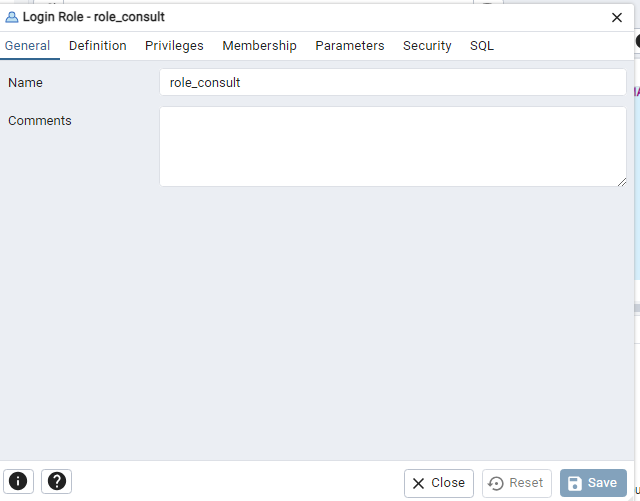

#### En la pestaña "Definition":
- Establece una contraseña para el rol si es necesario.

#### En la pestaña "Privileges":
- Asegúrate de que solo las casillas "Can login"  estén marcadas.
- Desmarca todas las demás opciones.


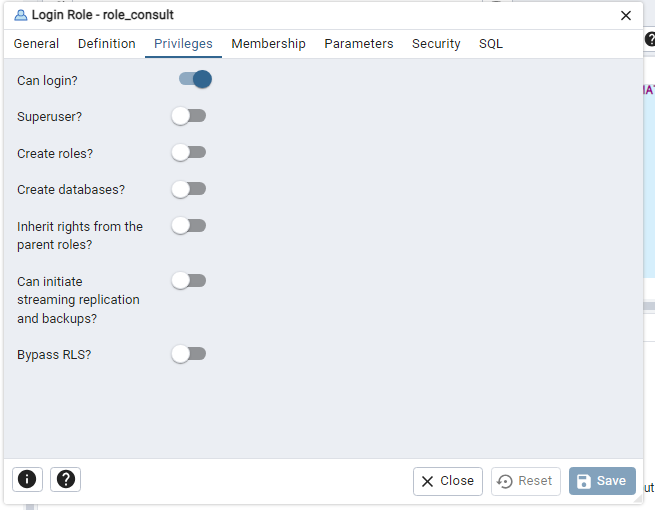


#### En la pestaña "Membership":
- No es necesario agregar membresías adicionales para un rol de solo lectura.

### 4. Asignar Privilegios de Solo Lectura:
- Navega a la base de datos en la que deseas que el rol tenga acceso de solo lectura.
- Haz clic derecho en la base de datos y selecciona "Properties".
- En la ventana de propiedades de la base de datos, selecciona la pestaña "Privileges".
- Haz clic en el icono de agregar rol (un signo más) y selecciona el rol `read_only` que creaste.
- Asigna los siguientes privilegios:
  - `CONNECT`: Permite al rol conectarse a la base de datos.
  - `USAGE`: Permite al rol usar esquemas.
  - `SELECT`: Permite al rol leer datos de las tablas.

### 5. Aplicar Privilegios a Esquemas y Tablas:
Aplicar privilegios de lectura a una tabla:

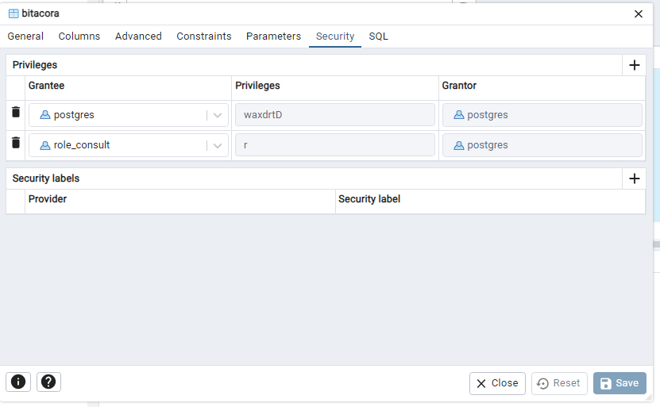


## Crear una Copia de Seguridad en PostgreSQL usando pgAdmin

### Pasos para Crear una Copia de Seguridad

#### 1. Abrir pgAdmin y Conectarse al Servidor:
- Abre pgAdmin y conéctate a tu servidor PostgreSQL.

#### 2. Seleccionar la Base de Datos:
- En el panel de navegación de la izquierda, expande el árbol del servidor al que estás conectado.
- Navega a la base de datos de la cual deseas crear una copia de seguridad.

#### 3. Iniciar la Herramienta de Copia de Seguridad:
- Haz clic derecho sobre la base de datos seleccionada.
- Selecciona "Backup..." en el menú contextual.

#### 4. Configurar la Copia de Seguridad:

##### En la pestaña "General":
- **Filename:** Especifica la ubicación y el nombre del archivo de copia de seguridad. Por ejemplo: `/path/to/backup/mi_base_de_datos.backup`
- **Format:** Selecciona el formato de la copia de seguridad. Generalmente se recomienda el formato "Custom" (Personalizado) ya que permite una mayor flexibilidad en la restauración.


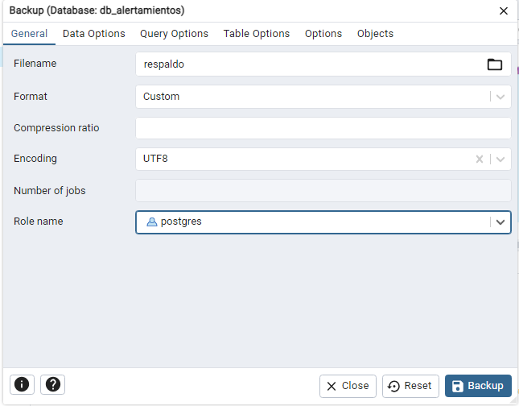


## Configurar Replicación y Alta Disponibilidad en PostgreSQL usando pgAdmin

### Introducción

Este documento detalla los pasos necesarios para configurar un proceso de replicación y alta disponibilidad en PostgreSQL utilizando pgAdmin. La replicación y alta disponibilidad son esenciales para asegurar la continuidad del servicio y la integridad de los datos en entornos de producción.

### Prerrequisitos

- Dos o más servidores PostgreSQL (Primary y Standby).
- pgAdmin instalado y configurado.
- Acceso de superusuario a todos los servidores PostgreSQL involucrados.
- Conexiones de red entre los servidores configuradas y funcionando.

### Pasos para Configurar la Replicación y Alta Disponibilidad

#### 1. Configuración del Servidor Primario (Primary)

##### Editar el archivo `postgresql.conf`
- Ubica y abre el archivo `postgresql.conf` en el servidor primario.
- Habilita la replicación configurando los siguientes parámetros:

```sql
listen_addresses = '*'
wal_level = replica
max_wal_senders = 5
wal_keep_segments = 32
hot_standby = on
```
##### Reiniciar el Servidor PostgreSQL
```sql
sudo systemctl restart postgresql
```


#### 2. Configuración del Servidor Standby
##### Realizar una Copia de Seguridad Base del Servidor Primario
En el servidor primario, realiza una copia de seguridad base que será utilizada para inicializar el servidor standby:

```sql
pg_basebackup -h [IP_del_Primary] -D /var/lib/postgresql/[version]/main -U [usuario_replicacion] -Fp -Xs -P -R
```

##### Editar el Archivo postgresql.conf
Ubica y abre el archivo postgresql.conf en el servidor standby.

##### Configuración de Parámetros
Configura los siguientes parámetros:
```sql
hot_standby = on
```

#### 3. Configurar la Autenticación de Replicación
##### Crear un Usuario de Replicación en el Servidor Primario
Conéctate al servidor primario usando pgAdmin.

##### Creación del Usuario
Crea un usuario para la replicación:

```sql
CREATE USER replicator WITH REPLICATION ENCRYPTED PASSWORD 'replicator_password';
```

#### 4. Iniciar el Servidor Standby
##### Inicio del Servidor PostgreSQL
Inicia el servidor PostgreSQL en el servidor standby:

```sql
sudo systemctl start postgresql
```

#### 5. Verificar la Replicación
##### Verificación del Estado de la Replicación
Conéctate al servidor primario usando pgAdmin.

##### Ejecución de la Consulta
Ejecuta la siguiente consulta para verificar el estado de la replicación:

```sql
SELECT * FROM pg_stat_replication;
```

Deberías ver una entrada correspondiente al servidor standby indicando que la replicación está activa.


### Consultas de prueba.

#### Consulta 1

**Obtener el número de detecciones por tipo de tráfico en un rango de fechas específico**
```sql
SELECT 
    t.tipo AS tipo_trafico,
    COUNT(b.id_registro) AS numero_detecciones
FROM 
    alertas.bitacora b
JOIN 
    alertas.cat_tipo_trafico t ON b.id_tipo_trafico = t.id_tipo
WHERE 
    b.fecha BETWEEN '2023-01-01' AND '2023-12-31'
GROUP BY 
    t.tipo
ORDER BY 
    numero_detecciones DESC;
```
**Resultado**


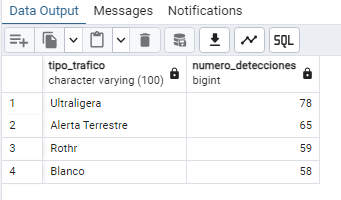


#### Consulta 2

**Listar las detecciones con coordenadas específicas y el estado de detección**

```sql
SELECT 
    b.id_registro,
    b.fecha,
    b.hora_deteccion,
    b.latitud,
    b.longitud,
    b.estado_deteccion
FROM 
    alertas.bitacora b
WHERE 
    b.latitud BETWEEN 20.000000 AND 21.000000
    AND b.longitud BETWEEN -100.000000 AND -99.000000
ORDER BY 
    b.fecha DESC, b.hora_deteccion DESC;

```
**Resultado**


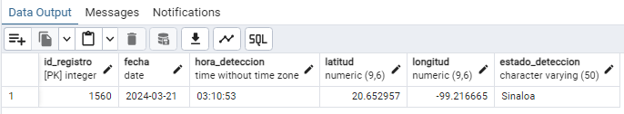


#### Consulta 3

**Obtener el número de detecciones por país y por estado en un turno específico**

```sql
SELECT 
    p.pais AS pais_deteccion,
    b.estado_deteccion,
    COUNT(b.id_registro) AS numero_detecciones
FROM 
    alertas.bitacora b
JOIN 
    alertas.cat_pais p ON b.id_pais_deteccion = p.id_pais
WHERE 
    b.id_turno = 1
GROUP BY 
    p.pais, b.estado_deteccion
ORDER BY 
    numero_detecciones DESC;

```
**Resultado**


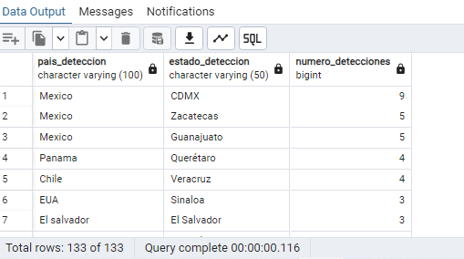


### Archivo de BACKUP de la base de datos.

[Descargar archivo de restauración](https://github.com/Juliodfconde/Curso_postgress/blob/main/backup/db_alertamientos270620204.sql)
